<div align="center">



<a href="https://tripos.dev"></a>

<br/>

<a href="https://tripos.dev"></a>
<a href="https://krishmehta.space"></a>
<a href="https://linkedin.com/in/krish-mehta-20368b24b"></a>
<a href="mailto:krishmehta77@gmail.com"></a>

</div>

---

```console
$ whoami --verbose

krish mehta
├── now      implementation engineer @ harness          [ACTIVE]
├── before   software engineer @ paypal                 18 months
├── school   trinity college dublin · B.A.I.            2020–2024
├── located  bengaluru, in                              remote-first
└── does     puts AI agents inside enterprise systems that did not ask for them
```

<br/>

```console
$ kubectl get deployments --namespace=krish --sort-by=.status.impact

NAME                        REPLICAS   STATUS     EXPOSURE              AGE
tripos-control-plane        11/11      Running    public · tripos.dev   live
paypal-mcp-server            1/1       Running    20,000 devs           18mo
harness-accelerators         3/3       Running    enterprise clients    current
blackjack-trainer            1/1       Running    public                stable
```

<table>
<tr>
<td width="50%" valign="top">

<h4><code>tripos-control-plane</code> &nbsp;<a href="https://tripos.dev"></a></h4>

Eleven agents in production. Planner and worker tiers, hierarchical delegation,
routing across Opus / Sonnet / Haiku by task complexity — the cheap model does the
cheap work, and the bill reflects it.

<pre><code>routes    126
models     55
tests     837
stack     next 15 · ts · postgres · redis · s3</code></pre>

</td>
<td width="50%" valign="top">

<h4><code>paypal-mcp-server</code></h4>

Natural-language Model Context Protocol server. One conversational surface over
Artifactory, GitHub and Jira — search and command execution, no context switching.

<pre><code>users    20,000+ engineers
ops      2M+ daily
scope    internal
note     ask me, i'll draw it</code></pre>

</td>
</tr>
<tr>
<td width="50%" valign="top">

<h4><code>harness-accelerators</code></h4>

Three Claude-powered onboarding accelerators shipped into live customer estates.
One takes a bare repo to a working CI/CD pipeline with security testing wired in,
in a single pass.

<pre><code>before   weeks of kickoff
after    one working session
built    claude · github · harness</code></pre>

</td>
<td width="50%" valign="top">

<h4><code>blackjack-trainer</code> &nbsp;<a href="https://black-jack-trainer-khaki.vercel.app"></a></h4>

Pure-function strategy engine, invariant-tested. No backend to fail, no network
after first load. Small on purpose.

<pre><code>modes     17
backend   none
stack     react 19 · vite 6</code></pre>

</td>
</tr>
</table>

<br/>

```console
$ cat /etc/krish/lenses.conf     # same operator, four angles

[ai-engineer]      agents · MCP · RAG that survives contact with prod · evals
[forward-deployed] customer estates · integration design · discovery → go-live
[platform]         k8s · terraform · CI/CD · supply chain · 40% less downtime
[consulting]       enterprise delivery · exec rooms · the thing nobody scoped
```

<br/>

```console
$ apt list --installed | grep -v abandoned

python/stable            typescript/stable        next.js/stable
react/stable             node/stable              postgres/stable
prisma/stable            redis/stable             docker/stable
kubernetes/stable        terraform/stable         aws/stable
gcp/stable               datadog/stable           claude/daily-driver
mcp/stable               rag+vectors/stable       playwright/stable
```

<br/>

```console
$ tail -f /var/log/krish/status.log

[building]  agentic delivery tooling customers keep using after i leave
[reading]   eval harnesses — vibes are not a test suite
[shipping]  agents that survive their first contact with a customer estate
[note]      most of my work ships in private enterprise repos, so the
            contribution graph lies. the deployments above are the truth.
```

<div align="center">

```
────────────────────────────────────────────────────────────────────────
   tripos.dev  ·  krishmehta.space  ·  linkedin  ·  krishmehta77@gmail.com
────────────────────────────────────────────────────────────────────────
```

<a href="https://tripos.dev"></a>

<sub><code>EOF</code> · built by the operator, shipped by the agents</sub>

</div>
